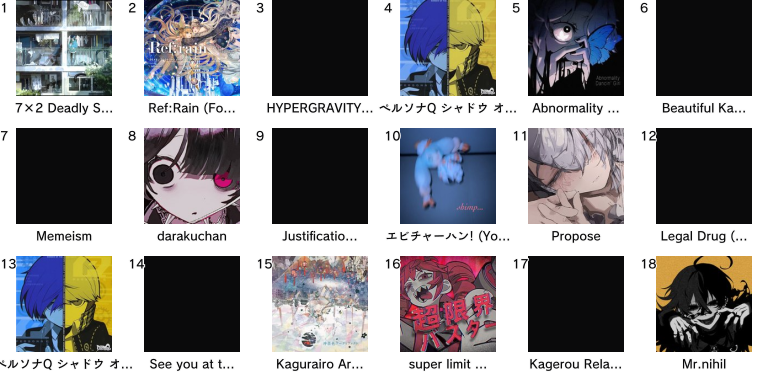

# Hi! I'm Raymond.

I am a self-taught programmer and a senior in high school (12th grade). I do webdev work in languages / systems such as TypeScript and Svelte. I also like to work in real-world-applicable languages such as C++, primarily taking interest in the WebAssembly scene. I also enjoy graphics programming projects but I often get stuck (and why I haven't published much involving it)

I also have been learning Blender for around 4 years as a secondary hobby (focusing on character modeling). Maybe if AI takes the entire programming space over, I can work for Hoyoverse or something, I guess...

Profile picture is of Red Savarin from Solatorobo. [かなとふぐ](https://www.pixiv.net/en/artworks/116972716) is the artist (it can be removed upon their request).

## Interests

I like to play arcade rhythm games, especially the one with a cute little penguin :penguin:

### Projects / Major Contributions

[AquaDX](https://github.com/MewoLab/AquaDX): An arcade server. 
[Nijika](https://github.com/MewoLab/nijika-wasm): A Unity AssetBundle parser for web or Node.js environments.

### Music

