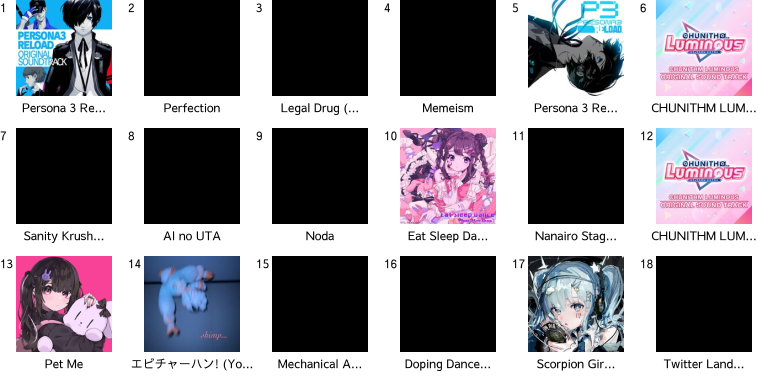

# Hi! I'm Raymond.

I am a self-taught programmer and by technicality a "certified IT technician"—**I got my CompTIA 1101/1102 A+ recently! :confetti_ball:** 
I prefer working on webdev, but I'm branching out and doing backend and non-web software development as well.

## Current Interests

[AquaDX](https://github.com/MewoLab/AquaDX) (backend) / [AquaNet2](https://github.com/MewoLab/AquaNet2) (web frontend)

[I had to remove all of the icons I used because GitHub changed something about the markdown viewer and every icon was humungous. Sigh]

## Top Weekly Albums

